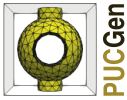
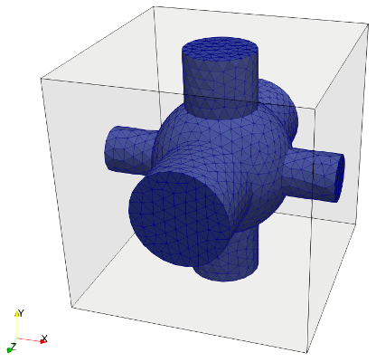
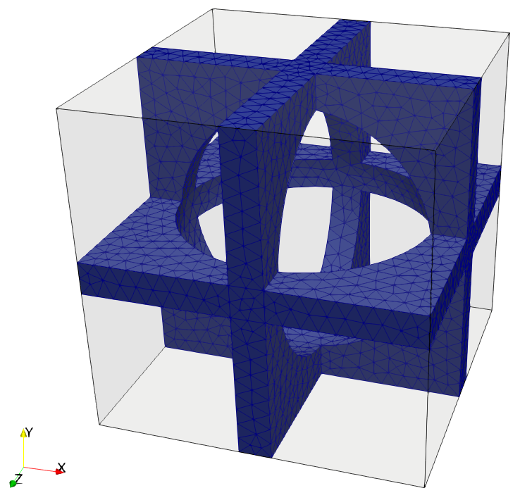
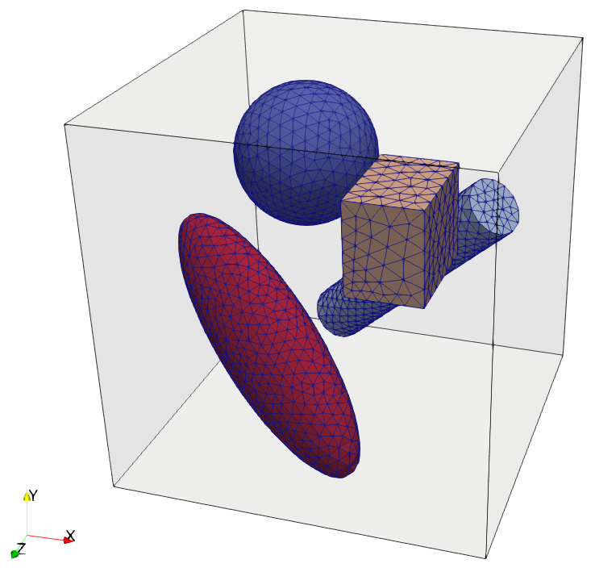
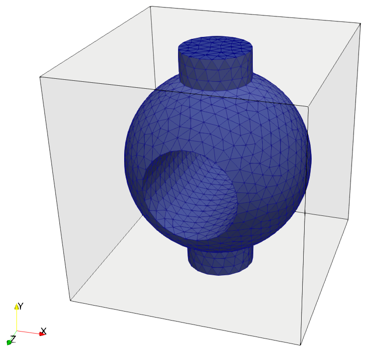

 

# PUCGen - Periodic Unit Cell Generator

A python script for generating periodic unit cells.

## Requirements

* [Gmsh](http://gmsh.info/) - three-dimensional finite element mesh generator
* [PyQt5](https://riverbankcomputing.com/software/pyqt/intro) - bindings for the Qt application framework (including OpenGL module)
* [Python bindings for VTK](https://vtk.org/download)

On Ubuntu based Linux distributions users can use the following command to install the required packages:

    apt install gmsh python-pyqt5 python-pyqt5.qtopengl python-vtk6

or:

    apt install gmsh python3-pyqt5 python3-pyqt5.qtopeng python3-vtk7

for Python3.

## Installation

* Download the code from the git repository:

      git clone git://github.com/vlukes/mumpspy

or

* Use [pip](https://pypi.org/project/pip/):

      pip install git+git://github.com/vlukes/mumpspy

## Usage

* Command line processing:

      python pucgen.py <input_file>

* Run the GUI:

      python pucgen.py

## Input file examples:

#### `example1.puc`:

```
BaseCell;size=(1, 1, 1);el_size=0.1;mat_id=5
SphericalInclusion;radius=0.3;central_point=(0, 0, 0);el_size=0.5;mat_id=2
CylindricalChannel;radius=0.1;central_point=(0, 0, 0);direction=x;el_size=0.5;mat_id=2
CylindricalChannel;radius=0.15;central_point=(0, 0, 0);direction=y;el_size=0.5;mat_id=2
CylindricalChannel;radius=0.2;central_point=(0, 0, 0);direction=z;el_size=0.5;mat_id=2
```


#### `example2.puc`:
```
BaseCell;size=(2, 1, 1);el_size=0.1;mat_id=1
SandwichLayer;thickness=0.1;central_point=(0, 0, 0);direction=x;el_size=0.5;mat_id=2
SandwichLayer;thickness=0.1;central_point=(0, 0, 0);direction=y;el_size=0.5;mat_id=2
SandwichLayer;thickness=0.1;central_point=(0, 0, 0);direction=z;el_size=0.5;mat_id=2
EllipsoidalInclusion;radius=(0.8, 0.4, 0.4);central_point=(0, 0, 0);direction=(1, 0, 0);el_size=0.5;mat_id=1
```


#### `example3.puc`:
```
BaseCell;size=(1, 1, 1);el_size=0.1;mat_id=1
SphericalInclusion;radius=0.2;central_point=(-0.2, 0.2, -0.2);el_size=0.4;mat_id=2
CylindricalInclusion;radius=0.08;length=0.8;central_point=(0.1, -0.1, -0.2);direction=(1, 1, 0.5);el_size=0.3;mat_id=3
BoxInclusion;size=(0.2, 0.25, 0.3);central_point=(0.2, 0.2, 0.2);el_size=0.5;mat_id=4
EllipsoidalInclusion;radius=(0.4, 0.15, 0.1);central_point=(-0.15, -0.15, 0.25);direction=(1, -1, 0.5);el_size=0.3;mat_id=5
```


#### `example4.puc`:
```
BaseCell;size=(1, 1, 1);el_size=0.1;mat_id=1
SphericalInclusion;radius=0.4;central_point=(0, 0, 0);el_size=0.5;mat_id=2
CylindricalChannel;radius=0.15;central_point=(0, 0, 0);direction=y;el_size=0.5;mat_id=2
CylindricalChannel;radius=0.2;central_point=(0, 0, 0);direction=z;el_size=0.5;mat_id=1
```
